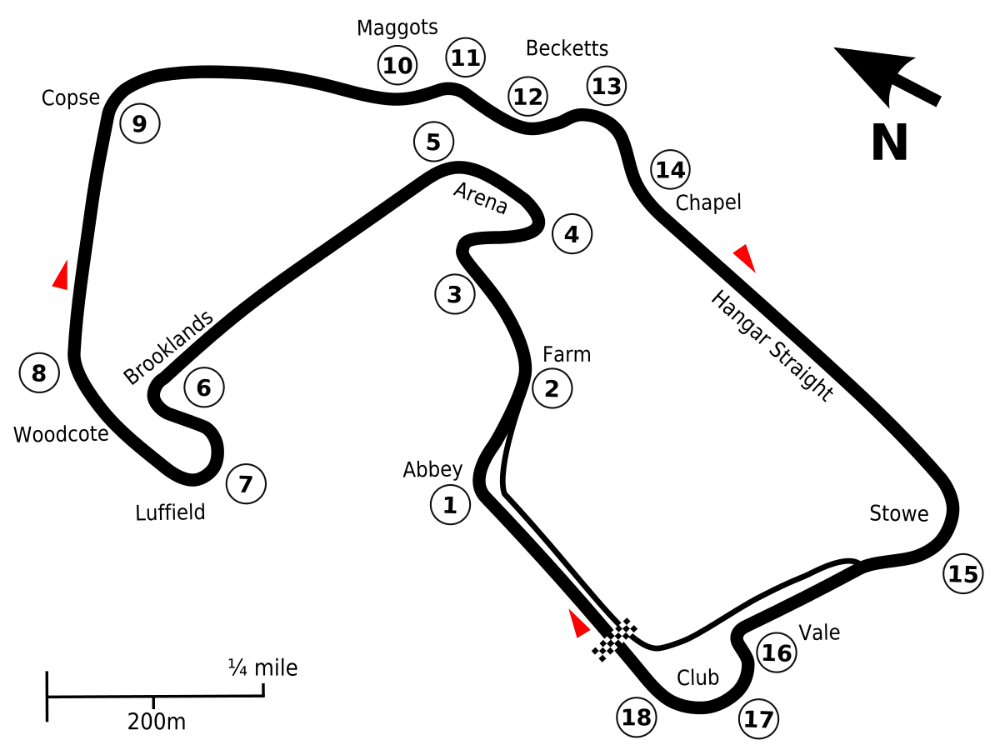

## Races of the year

### British Grand Prix

<ul style="color: black">
  <li>Location: Silverstone, Britain</li>
  <li>Founded in 1926</li>
  <li>52 Laps</li>
  <li>Most wins: Lewis Hamilton (8)</li>
</ul>

<body>

    

</body>

<!-- button to create table -->

    <input type="text" id="year" name="year" placeholder="Enter Year Here"
    style="width: 50%;
  padding: 5px 5px;
  margin: 8px 0;
  box-sizing: border-box;
  border: 2px solid #CD2A2A;
  border-radius: 40px;
  color: black;">
    <button type="submit" onclick="formSubmit()">Get Info</button>

    <input type="text" id="comment" name="comment" placeholder="Your Opinion"
     style="width: 50%;
  padding: 5px 5px;
  margin: 8px 0;
  box-sizing: border-box;
  border: 2px solid #CD2A2A;
  border-radius: 40px;
  color: gray;">
    <button type="Save Notes" onclick="notesSubmit()">Submit</button>
     

<!-- button to delete table -->

    <button type="submit" onclick="deleteTable(id)">Delete Table</button>

    <button type="submit" onclick="deleteComments(id)">Delete Comments</button>

  ---------------------------

<table id = "comments">
    <thead>
      <tr>
        <th>User</th>
        <th>Season</th>
        <th>Comment</th>
      </tr>
    </thead>
    <tbody></tbody>
</table>

    

  
</html>
